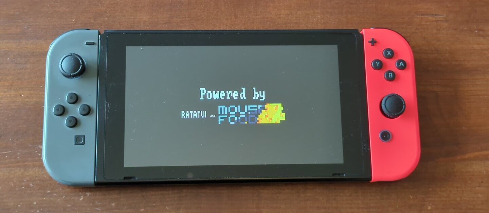
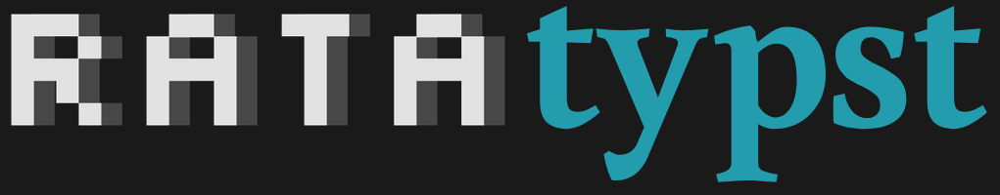
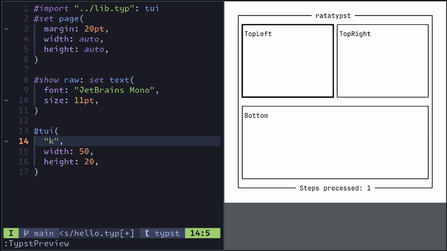
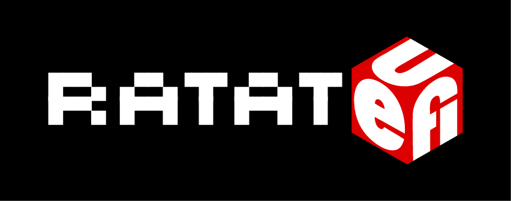

<!-- jump_to_middle -->
Yes, I would say so!
---

<!-- end_slide -->
# Who am I?

<!-- pause -->
- Swedish student
    - Final year of M.Sc. Computer Science and Engineering at Linköping University
<!-- newline -->
<!-- pause -->

- Rust enthusiast since 1 year
<!-- newline -->
<!-- pause -->

- **I have a parasocial relationship with Orhun Parmaksız**

<!-- end_slide -->
# The next 5 minutes

<!-- incremental_lists: true -->

- My journey of porting Ratatui
    - ..to the Nintendo Switch
    - ..to PDFs (`ratatypst`)
    - ..to SVG  (`ratasvg`)
    - ..to UEFI (`ratatuefi`)

- Previous work

<!-- end_slide -->
<!-- jump_to_middle -->
Ratatui on the Nintendo Switch
---

<!-- end_slide -->
# Ratatui on the Nintendo Switch

- The `aarch64-switch-rs` project gives Rust bindings to homebrew libraries

<!-- new_lines: 0 -->

- `mousefood` gives a Ratatui backend for rendering to bitmap graphics (with `embedded-graphics`)

<!-- end_slide -->

<!-- end_slide -->
_next up..._
<!-- jump_to_middle -->

<!-- end_slide -->
# Ratatui in PDFs: _ratatypst_
<!-- pause -->
- `Typst` is a fantastic modern alternative to LaTeX _(written in Rust btw)_
<!-- new_line-->
<!-- pause -->
- You can write Typst plugins in _any language that compiles to WASM!_
<!-- new_line-->
<!-- pause -->
- `ratatypst` is my library for creating plugins that render Ratatui widgets!
<!-- new_line-->
<!-- pause -->

<!-- end_slide -->

<!-- end_slide -->

Typst compiles code to PDF.

This is not an interactive environment..

..yet, because Typst can be rendered instantly

..we can write deterministic Ratatui apps that take a string of keypresses _(like `hjklhlhkjkj khljh`)_

<!-- end_slide -->
_next up..._

<!-- end_slide -->
# Ratatui before the OS: _ratatuefi_
<!-- pause -->

- The crate `uefi` provides nice API for writing UEFI applications

<!-- new_line-->
<!-- pause -->
- Together with my library `ratatuefi`, you can create Ratatui UEFI applications!

<!-- new_line-->
<!-- pause -->
- _(I am using `efimux`, my own bootloader-like EFI app to boot Arch Linux)_

<!-- end_slide -->

<!-- end_slide -->
_next up..._

<!-- jump_to_middle -->

ratasvg
---

<!-- new_lines: 3 -->

_(i haven't created any cursed logo.. yet..)_

<!-- end_slide -->

# Ratatui widgets to SVGs: _ratasvg_ (1/2)

<!-- list_item_newlines: 2 -->
<!-- incremental_lists: true -->

- _Very undercooked..._
- My idea: use Ratatui for graphic design
<!-- end_slide -->
# Ratatui widgets to SVGs: _ratasvg_ (2/2)
<!-- list_item_newlines: 2 -->
<!-- incremental_lists: true -->
- I am unsure of what the user interface should be
    - Current design: it is just a library
    - Would be cool to have a CLI that scans your codebase for (specific?) Ratatui widgets and auto-render them

<!-- end_slide -->
<!-- jump_to_middle -->
Previous work
---

<!-- end_slide -->
# Previous work
<!-- list_item_newlines: 2 -->

- `mousefood`: embedded-graphics backend 
- `ratzilla`: Ratatui for the web
- `tui-uefi`: which seems to have existed months before `ratatuefi`..
- `egui_ratatui`: egui widget + Ratatui backend
- ...and much more under https://github.com/ratatui/awesome-ratatui

<!-- end_slide -->
<!-- jump_to_middle -->
My takeaways
---

<!-- end_slide -->
# My takeaways
<!-- incremental_lists: true -->
<!-- list_item_newlines: 2 -->
- I haven't done anything special, mostly glued together existing projects

    - The Rust ecosystem is surprisingly mature, even for niche platforms

- It's sooo nice to be able to use **one language** for so many different contexts and platforms

<!-- end_slide -->
# Links

- https://github.com/ratatui/ratatui
- https://github.com/sermuns/ratatui-on-nintendo-switch
- https://github.com/aarch64-switch-rs
- https://github.com/ratatui/mousefood
- https://github.com/sermuns/ratatypst
- https://github.com/sermuns/ratatuefi
- https://github.com/sermuns/efimux
- https://github.com/sermuns/ratasvg

<!-- end_slide -->
<!-- jump_to_middle -->
Thank you!
---

<!-- alignment: center -->

https://github.com/sermuns
